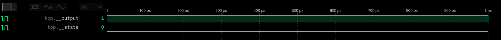
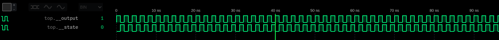
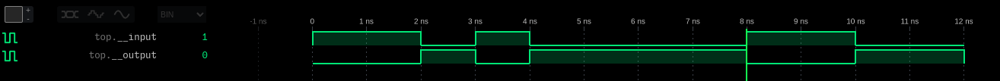
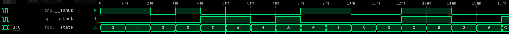

= a5-1-rhdl
A rhdl implementation of the a5/1 stream cipher

NOTE: This doc is currently more of a unstructured diary of my progress than a proper documentation. I will try to clean it up later.

== Motivation

I used rusthdl before and it was quite nice. rusthdl development stopped and moved to its successor rhdl. However, rhdl is not quite finished yet, but should be usable. In this project I want to implement the a5/1 stream cipher in rhdl, to see how ready it is. I also want to document the process of using (and figuring out how to use) rhdl, so other people have it easier to get started.

== Setup

rhdl is currently not really documented, so we have to figure out how to install it.

First I created a new rust project using `cargo init`. Now I want to add the rhdl dependencies. They dont seem to be on crates.io, so I have to add them manually. I expect to need to make some changes to rhdl on the way, so I cloned the repo to my machine and added them as path dependencies. I am not yet sure which deps I need so I added all that are used by the https://github.com/samitbasu/rhdl/blob/main/rhdl/Cargo.toml[rhdl crate Cargo.toml]. I added the following to my `Cargo.toml`:

```
[dependencies]
rhdl = { path = "../rhdl/rhdl" }
rhdl-core = { path = "../rhdlrhdl-core", features = ["iverilog"] }
rhdl-macro = { path = "../rhdl/rhdl-macro", version = "0.0.2" }
rhdl-std = { path = "../rhdl/rhdl-std" }
rhdl-fpga = { path = "../rhdl/rhdl-fpga" }
```

I am not sure what I should do next. I think I should first verify that rhdl works at all on my machine. I change into the rhdl repo and try to run `cargo test`. errros, that suggest icarus verilog is missing I think. I will add it to PATH and try again. Tests pass this time. *`iverilog` needs to be in the path for rhdl to work*. One test still fails, as it seems to require a `yosys` binary. I will install it and try again. I installed yosys, but the test still fails. However, the logs indicate, that it synthesizes but is missing some kind of file or something in the end. Ill ignore it for now.

I think the test that requires yosys probably contains a full example, as yosys is probably used quite late in the pipeline. So I take a look at that test (`test synchronous::get_blinker_synth`). Seems to be a full example, I will try to add it to my repo and get it to run here. Probably without the yosys part.

I copied that test, but the imports are still missing. I will use rust-analyzer to get some recommendations for the correct inputs and trial and error until it works. The imports are also shown in the example below. It is comforting, that the helpers I know from rusthdl (blinker, strobe, ...) are also used here with the same names.


.That test
[source,rust,indent=0]
----
include::src/rhdl_blinker_test.rs[tag=main]
----

Seems to work as good as in the rhdl repo. The example is targeting fpgas, which means we run into the yosys error from before. Lets try to understnad and fix it. Maybe it has something to do with json, as it appears after the `Executing JSON backend.` step. I will consult a search engine. No actionable results. Proper debugging would probably involve to convince yosys to print more debug output. before i try this I just add some more dependencies to my system, hoping that it will fix the problem. `nextpnr`, `netlistsvg`, `mcy`, `arachne-pnr`, `yosys-synlig`. Does not change anything.

I looked into the source of rhdl to figure out which commands are called. Turns out icepack (from icestorm) is also required but missing on my system. I will open a upstream PR that adds good error messages. I added icestorm to the nix environment, now the test passes. I alos remove the extra dependencies I added earlier, because they are not used but I kept nextpnr, because it is required.

Time to figure out how to use rhdl for a dummy example.

=== Looking at the test

The test first defines a rhdl module for a blinker, which looks like a rusthdl module. I have hopes that rhdl has a syntax similar to rusthdl. 

.The blinker module
[source,rust,indent=0]
----
include::src/rhdl_blinker_test.rs[tag=blinker]
----

The second part is synthesizing the module into hardware. While rusthdl did only output verilog (I think, never tried to use yosys directly from rusthdl) rhdl seems to include a simple yosys/nextpnr/icepack toolchain to directly produce FPGA bitstreams. This is quite nice, but not what we need for this project.

Running the test produces a blink directory with a lot of logs and output files. It also places a blink.v and blink.pcf file in the root of the project. The pcf probably contains some hardware related stuff. We are only interested in the verilog file. I will figure that out later, but just removing the FPGA parts should do the trick, I think.

=== Figuring out simulation and testing

We want ot output verilog and also want to simulate/test our design directly with `cargo test`. I will try to implement a simple design that controls three flashing lights.

As looking at test worked quite well previously I searched for a test that simulates and runs a design. I got sidetracked and toyed a bit with the Blinker and PulserStart implementations. I think a got next step is to do a inverter module that inverts a signal. Not sure if it will be synchronous or not.

I will start out with the https://github.com/samitbasu/rhdl/blob/0a1cc6410f1fe8d96d9a8f17dd8008b7528f7a50/rhdl/src/synchronous.rs#L70-L88[StartPulser] module from the synchronous.rs file in rhdl.

.StartPulser
[source,rust]
----
#[derive(Copy, Clone, PartialEq, Eq, Debug, Digital, Default)]
pub struct StartPulse {}

impl Synchronous for StartPulse {
    type Input = ();
    type Output = bool;
    type State = bool;
    type Update = pulse_update;

    const INITIAL_STATE: Self::State = false;
    const UPDATE: fn(Self, Self::State, Self::Input) -> (Self::State, Self::Output) = pulse_update;
}

#[kernel]
pub fn pulse_update(_params: StartPulse, state: bool, _input: ()) -> (bool, bool) {
    note("state", state);
    note("output", !state);
    (true, !state)
}
----

In the first line the module is defined as a struct. The only notable thing seems to be the Digital trait we are deriving. Not sure what it does.

After that the Synchronous trait is implemented. It defines the inputs, outputs, internal state, and update behaviour of the modules.
The StartPulse module has no inputs and outputs a single bit.
It internally keeps track of a single bit state.
We also define the type of our update function. I am not entirely sure, why we need to do this because the type can probably be derived from the Input, Output and State types. The update function seems to define how a synchronous module changes its state on a clock cycle. It seems to be a pure function that maps old state and input to new state and output.

After the types we define the initial state of the module and give it a function matching the signature of the update function.

The update function implementation is annotated with `#[kernel]` which seems to be a rhdl specific attribute that does something. Probably checking. In the function we output the inverted state and set the next state to true. This should result in one initial pulse and nothing else.
The note function is used to log the values. I think we can get a vcd file with the values of the notes later on.

I copied a test for StartPulse from the rhdl repo that simulates the module and outputs a vcd. It is shown in <<start_pulse_test>>. Based on the implementation we saw earlier, I would expect its output to be a single pulse and the state to be the inverse of the output. However the output shows that the signals dont change. I think the simulation may only run until the next change for some reason. The test even asserts that the simulation function only produces one output, which means exactly that, I think. 

.StartPulse test/simulation
[source,rust#start_pulse_test]
----
#[test]
fn test_start_pulse_simulation() {
    let input = std::iter::repeat(()).take(100);
    let pulse = StartPulse {};
    note_init_db();
    let outputs = simulate(pulse, input).filter(|x| *x).count();
    assert_eq!(outputs, 1);
    let mut vcd_file = std::fs::File::create("start_pulse.vcd").unwrap();
    note_take().unwrap().dump_vcd(&[], &mut vcd_file).unwrap();
}
----

.StartPulse test/simulation output


I think this is a dumb example, because we have no (or only one or two not sure) state changes in the vcd. I think we will get further with an experiment that continously changes. Lets modify the update function, so that it also flips the state on every update. I called the modified version ClockThing, because it should output a clock pulse.

If we do that and run the test again, it will fail, because the simulation now produces 50 outputs instead of one, which breaks the `assert_eq!(outputs, 1)`. This is an indicator, that it works. Lets change that assertion to 50 and run again.

.ClockThing fixed simulation


Success, that seems to work as expected. Lets try and understand the test function. We first define an iterator over 100 inputs. I suppose the simulation runs as long as there are inputs available. Then we create our dut.

The note_init_db() function is used to initialize the noteDB. noteDB seems to be the rhdl component responsible for timeseries logging. It seems like we can log values with the note function and later dump them using the `note_take()` function. The noteDB is a global (thread local) singleton, so we dont need to pass it around. Thats an interesting design choice. I think it is a good one, because it is quite annoying to pass around logging infrastructure. As its thread_local, we probably can probably just trust it to work in most situations. 

The simulate function takes an iterator over inputs and returns an iterator over the outputs. I really like this approach to simulation. Not sure how timings and stuff are done, probably this only works for synchronous circuits. I just realized that we are filtering the result to only contain results where the output is high, which is probably the reason, why our output is only 50 instead of 100. 100 would make more sense as we also have 100 inputs. If we remove the filter, we get 100 outputs.

The last part of the test writes the vcd file. The dump_vcd function takes a list of signals to dump. The dump_vcd function also has an input for clocks, I think we can put some extra clocks in here to have a reference clock in the vcd. Not interesting for now.

=== Implementing the inverter

It should be easy to implement a inverter with the knowledge I have now. 

We first define a struct for the inverter. Then we implement `Synchronous` for it. It takes a boolean as an input, and produces an inverted boolean as an output. It has no internal state. The update function is quite simple, it just returns he inverted input.

[source,rust]
----
include::src/inverter.rs[tag=inverter]
----

We add a test that simulates the inverter and creates a vcd file. As an input we use a sequence of predefined inputs. The ouput should be the inverted input. The vcd file should show the input and output signals. The vcd file is shown below.



The simulation seems to work as expected. The input is inverted and the vcd file shows the input and output signals.

NOTE:: I am viewing the traces with the WaveTrace vscode extension

=== Testing the inverter

For now we only simulated the inverter, but we also want to test it. So I will now attempt to create a testcase that verifies that our ouputs look as expected. The most basic idea is to collect the simulation results into a Vec and compare it against a sequence of expected outputs. This works well, but is only useful for tests, where we can specify the expected output. So tests with unknown runtime can probably not be tested using this approach.

[source,rust]
----
include::src/inverter.rs[tag=test_expected_output]
----

Testing and simulating seems to be quite straightforward lets not waste any more time here. I bet we can use the patterns we now know to do cooler stuff. 

=== Shift register

Lets implement a shift register. The synchronous trait seems to have the clock integrated, so we just need a single boolean input and output. In the simultation every new input will result in a clock cycle. The implementation and simulation is shown below.

[source,rust]
----
include::src/shift_register.rs[tag=main]
----

Simulating it yields the expected results, the output signal is the input signal delayed by four clock cycles.



The most tricky part here was to access individual bits of the state `Bits<4>`. I needed to use something like `get_bit::<4>(state, 3)`, which is not quite obvious. I tried `state[3]` and `state.get_bit(3)` but both dont work. I guess that is one of the restrictions that apply in kernel functions. I found it quite usefull to reference https://github.com/samitbasu/rhdl/blob/0a1cc6410f1fe8d96d9a8f17dd8008b7528f7a50/rhdl/src/tests.rs[rhdl/src/test.rs] for understanding how I can do things in kernel functions.

Looking at the implementation of get_bit (shown below), we can see that it is not a function but a struct that does weird stuff. But there is also a function, I am confused. Maybe some of the kernel magic has something to do with having a function and a struct with the same name. I will try to understand that later.

.https://github.com/samitbasu/rhdl/blob/0a1cc6410f1fe8d96d9a8f17dd8008b7528f7a50/rhdl-std/src/impl_get_bit.rs[rhdl-std/src/impl_get_bit.rs]
[source,rust]
----
pub fn get_bit<const N: usize>(x: Bits<N>, i: u8) -> bool {
    (x.0 >> i) & 1 == 1
}

fn vm_get_bit(args: &[rhdl_core::TypedBits]) -> anyhow::Result<rhdl_core::TypedBits> {
    args[0].get_bit(args[1].as_i64()? as usize)
}

#[allow(non_camel_case_types)]
pub struct get_bit<const N: usize> {}

impl<const N: usize> DigitalFn for get_bit<N> {
    fn kernel_fn() -> Option<KernelFnKind> {
        Some(KernelFnKind::Extern(ExternalKernelDef {
            name: format!("get_bit_{N}"),
            body: format!(
                "function [0:0] get_bit_{N}(input [{}:0] a, input integer i); get_bit_{N} = a[i]; endfunction",
                N - 1,
            ),
            vm_stub: Some(vm_get_bit),
        }))
    }
}
----

=== Generating verilog for the shift register

In the first example we also generated verilog, lets try doing that for our shift register. I am interested in whether the generated verilog has a clock, or if the implicit clocking is just a detail of the simulator. 

In the first example we generated verilog using the `make_constrained_verilog`, but that one just seems to apply for FPGAs as it comes from the rhdl_fpga module. The more generic function seems to be `generate_verilog`. I will try to use that one, but it requires something of type module. In the tests designs are converted to modules using the compile_design function, so we will also use that. Note that we only synthesized the update function and not the whole module with the initial state. I dont know yet how to do that.

The compile_design method fails, because `state << 4` is not supported yet. I will try to fix that later. For now I found that the verilog generation part requires the second parameter to be a Bits, but that is documented nowhere.

I added a test case that generates a verilog file:

[source,rust]
----
include::src/shift_register.rs[tag=generate_verilog]
----

The generated verilog file is shown below.

[source,verilog]
----
include::shift_register.v[]
----

The generated verilog is only a function, which is not really what I expected, but I guess it makes sense, considering that we only synthesized the update function. I wonder how a module with submodules would look like. As long as all parts are `Synchronous`, the update can probably be broken down to a single function. All the stateful things like `Bits` and their operations are probably implemented in directly in verilog.


== TODO

- [ ]: Understand how kernel functions work and what restrictions apply
- [ ]: Understand the function structs in kernel functions (like `get_bit`)
- [ ]: Try to adjust set_bit and get_bit to check for a valid index for the given bit size
- [ ]: Try to implement a helper function for generating verilog from a synchronous module
- [ ]: Fix stuff like `something << 4`

== Existing documentation

I did not find any documentation besides the code itself. There are some mentions of rhdls differences to rusthdl.

- Under development since 2023
- Includes a co-compiler
- Compiler includes
- Type inference
- Type checking
- SSA transformation
- Lowering passes for ifs, loops, etc.
- Intermediate representation form
- VM to run the IR
- Generation of Verilog (other languages to be added)
- Automated detection of timing collisions, etc.
- Much more Rusty!

- https://github.com/samitbasu/rhdl/blob/main/doc/osda2024/osda2024.pdf
- https://github.com/samitbasu/rhdl/blob/main/doc/latte24/latte.pdf

== Appendix

.Logs of the failing yosys test
[source]
----
...
Using template $paramod$e51a8a571bee774247b38f52d6e85fd62ae52cea\$lut for cells of type $lut.
Using template $paramod\$lut\WIDTH=32'00000000000000000000000000000011\LUT=8'11111000 for cells of type $lut.
Using template $paramod\$lut\WIDTH=32'00000000000000000000000000000010\LUT=4'1110 for cells of type $lut.
No more expansions possible.
<suppressed ~296 debug messages>
Removed 0 unused cells and 155 unused wires.

2.47. Executing AUTONAME pass.
Renamed 789 objects in module top (18 iterations).
<suppressed ~283 debug messages>

2.48. Executing HIERARCHY pass (managing design hierarchy).

2.48.1. Analyzing design hierarchy..
Top module:  \top

2.48.2. Analyzing design hierarchy..
Top module:  \top
Removed 0 unused modules.

2.49. Printing statistics.

=== top ===

   Number of wires:                171
   Number of wire bits:           1698
   Number of public wires:         171
   Number of public wire bits:    1698
   Number of memories:               0
   Number of memory bits:            0
   Number of processes:              0
   Number of cells:                174
     SB_CARRY                       48
     SB_DFF                          1
     SB_DFFESR                      26
     SB_DFFESS                       1
     SB_DFFSR                       26
     SB_LUT4                        72

2.50. Executing CHECK pass (checking for obvious problems).
Checking module top...
Found and reported 0 problems.

2.51. Executing JSON backend.

End of script. Logfile hash: cea76f269f, CPU: user 1.21s system 0.02s, MEM: 41.12 MB peak
Yosys 0.38 (git sha1 543faed9c8c, gcc 13.2.0 -fPIC -Os)
Time spent: 48% 21x read_verilog (0 sec), 9% 24x opt_clean (0 sec), ...

Error: No such file or directory (os error 2)


failures:
    synchronous::get_blinker_synth
----